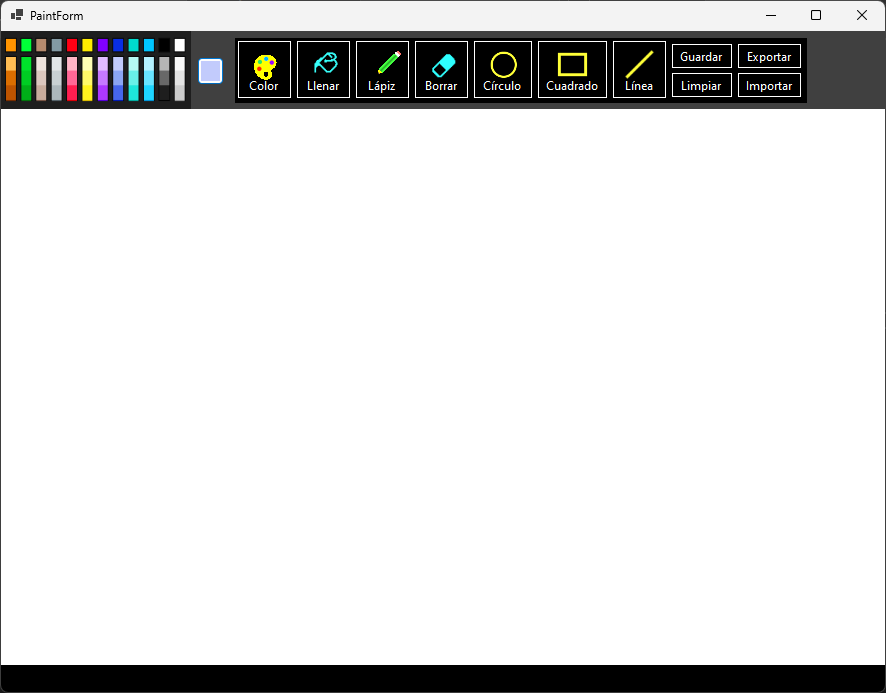
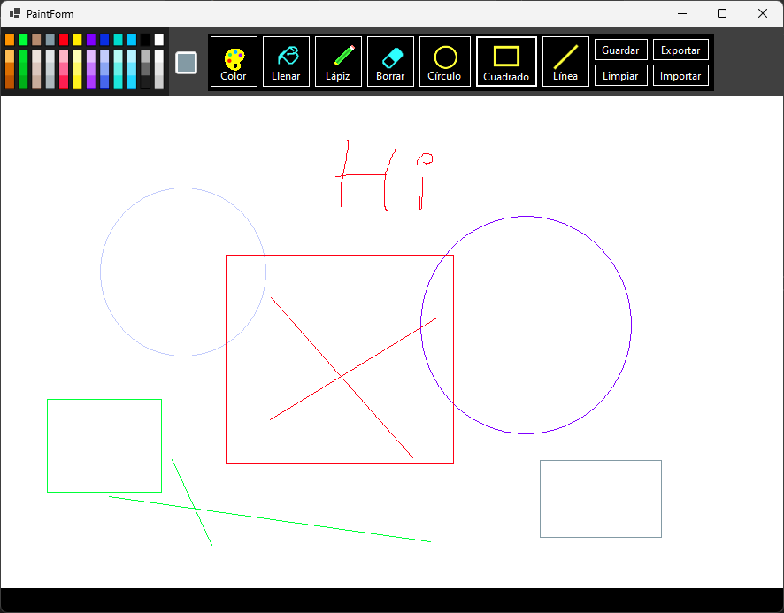

# Paint Basic

This is a basic way to build a paint desktop application like ms paint

# Requirements
* Dotnet 7 or + (Maybe works with previous versions, I don't know)
* Visual Studio or Rider (by jetbrains)

## How to install
* git clone https://github.com/JorshBG/Paint-Basic.git
* Open visual studio
* Open project/folder
* Select the repository
* Double click on the solution name
* Press play

# Preview
* Basic options and a blank panel

#
* Basic traces on the panel 

